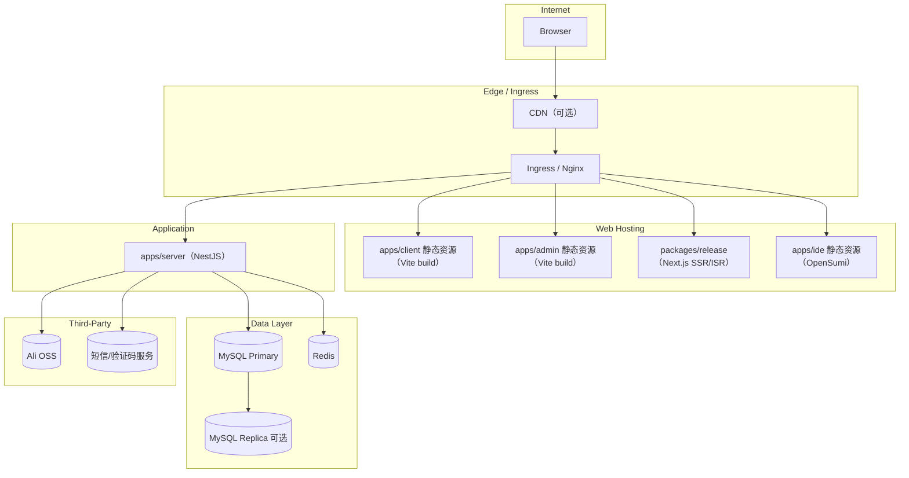

# 2. 部署与运行环境

## 2.1 部署拓扑图（建议）

图稿源码：[`deployment-topology.mmd`](../diagrams/deployment-topology.mmd)

## 2.2 运行环境与配置项

### 基础运行环境

- Node.js：建议 LTS（≥ 20）
- MySQL：建议 8.x（支持更完善的 JSON/索引能力；当前实体里存在 simple-json 字段）
- Redis：建议 6.x/7.x

### 必需环境变量（建议基线）

后端 `apps/server` 建议通过环境变量注入敏感信息，避免硬编码。

- `JWT_SECRET`：JWT 签名密钥
- `ACCESS_KEY_SECRET`：对象存储密钥（AccessKeySecret）
- `APP_KEY` / `APP_SECRET` / `APPCODE`：短信/验证码服务配置（以供应商要求为准）
- `DB_HOST` / `DB_PORT` / `DB_USER` / `DB_PASSWORD` / `DB_NAME`：数据库连接
- `REDIS_HOST` / `REDIS_PORT`：Redis 连接

## 2.3 弹性伸缩策略

- 前端静态资源：CDN + Cache-Control；版本化静态资源（hash 文件名）用于强缓存。
- 后端 API：
  - 通过负载均衡/Ingress 水平扩容多个实例（无状态）。
  - 对长连接（Socket.io）启用 sticky session，或将 socket adapter 改为 Redis adapter 以支持跨实例广播。
- 任务与耗时操作：
  - 文件上传走 OSS 直传（可选），降低后端带宽瓶颈。
  - 需要后台异步任务时引入队列（如 BullMQ/Redis Stream），并将任务执行从 HTTP 请求链路剥离。

## 2.4 容灾与备份恢复

### MySQL

- 备份：
  - 每日全量备份 + binlog 增量（保留周期按合规与存储成本设定）。
  - 关键表做校验（行数/校验和）与恢复演练。
- 恢复：
  - RPO/RTO 目标写入 NFR 文档，并在演练中验证。
- 高可用：
  - 主从复制（异步/半同步按 SLA 选择），并配合自动故障切换方案（MHA/Orchestrator/云厂商托管）。

### Redis

- 用作缓存/验证码等“可重建状态”优先，减少 Redis 对强一致业务的影响范围。
- 对高 SLA 场景可启用哨兵/集群，或使用云托管。

### OSS

- 设置对象生命周期与归档策略（热/冷分层）。
- 对关键资产启用跨区域复制（按成本评估）。

