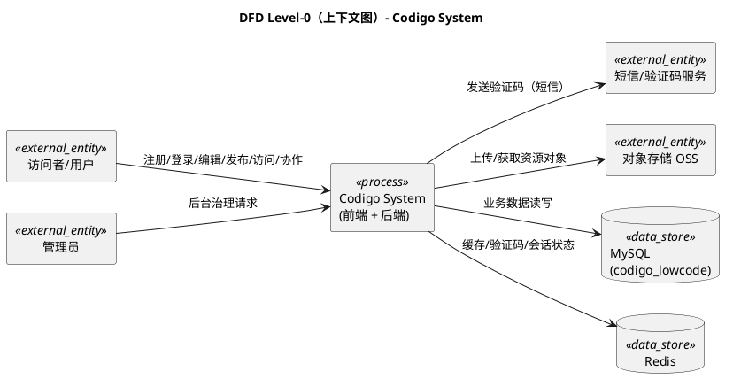
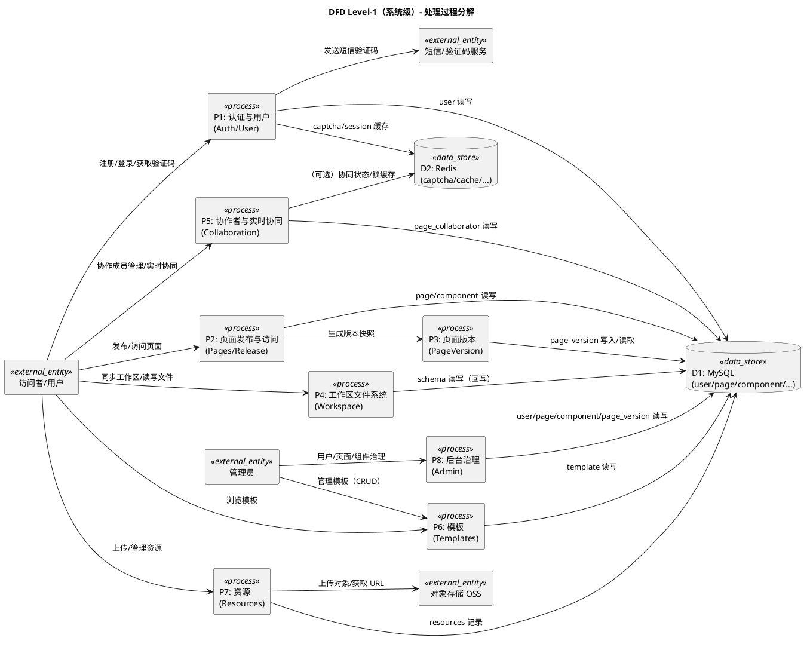
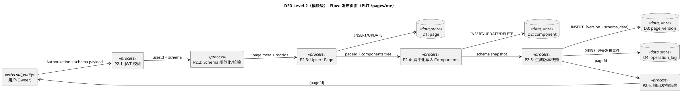

# 7. 数据流图（DFD）

本章采用可版本化的 PlantUML 源码描述 DFD（Yourdon/Gane-Sarson 风格的“外部实体 / 处理过程 / 数据存储 / 数据流”要素）。字段级数据字典见：[`03-data-dictionary.md`](./03-data-dictionary.md)。

## 7.1 Level-0（上下文图）

图稿源码：[`dfd-level0-context.puml`](../diagrams/dfd-level0-context.puml)

## 7.2 Level-1（系统级）

图稿源码：[`dfd-level1-system.puml`](../diagrams/dfd-level1-system.puml)

## 7.3 Level-2（模块级示例：Flow 发布页面）

图稿源码：[`dfd-level2-flow-release.puml`](../diagrams/dfd-level2-flow-release.puml)

## 7.4 数据敏感性、加密与脱敏（摘要）

详细策略见：[`../nfr/03-security.md`](../nfr/03-security.md)

- **敏感数据识别**：
  - 认证类：JWT、密码哈希、验证码、短信服务密钥、OSS 密钥。
  - 用户类：手机号、头像、昵称等个人信息。
  - 业务类：页面 schema（可能包含文本/表单提交数据）。
- **存储与传输**：
  - 传输层强制 HTTPS；token 仅通过 Authorization 头传递。
  - 密码使用 bcrypt 哈希存储，禁止明文。
  - 对日志/审计输出做脱敏（手机号、token、密钥）。

