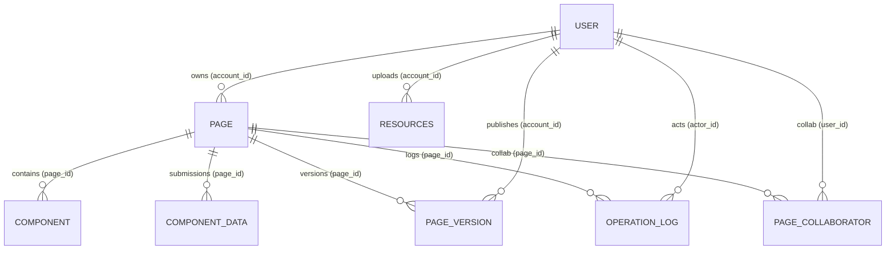

# 8. ER 图与数据模型（MySQL）

本章以 `apps/server` 的 TypeORM 实体为单一事实源，对应当前数据库表结构（当前使用 `synchronize: true` 自动同步）。建议在生产环境迁移到“迁移脚本（migrations）+ 明确的索引/约束”模式，避免隐式变更。

## 8.1 ER 图（Crow’s Foot）

图稿源码：[`er-crowsfoot.mmd`](../diagrams/er-crowsfoot.mmd)

说明：
- 当前实现未声明外键/关系装饰器（FK/Relation），ER 图表达的是**逻辑关联**（通过 *_id 字段关联）。
- 若要提升一致性与查询性能，建议补齐外键、唯一约束与索引（见 8.3）。

## 8.2 表结构（字段说明）

说明：
- 类型为“TypeORM 默认值”的字段，其 MySQL 真实列类型可能因命名策略/版本差异略有差异；以实际 `SHOW CREATE TABLE` 为准。
- `simple-json` 通常以 `text` 存储 JSON 字符串；`simple-array` 通常以 `varchar/text` 存储逗号分隔字符串。

### 8.2.1 user

实体来源：`apps/server/src/modules/user/entity/user.entity.ts`

| 字段 | 类型（MySQL） | 可空 | 默认值 | 说明 |
|---|---|---:|---|---|
| id | int | 否 | auto_increment | 主键 |
| username | varchar(255) | 否 |  | 用户名 |
| head_img | varchar(255) | 是 | null | 头像 |
| phone | varchar(255) | 否 |  | 手机号（建议唯一） |
| password | varchar(255) | 否 |  | bcrypt 哈希 |
| open_id | varchar(255) | 否 |  | 第三方 open_id（语义依业务） |
| global_role | varchar(20) | 否 | USER | 全局角色（SUPER_ADMIN/ADMIN/USER） |
| admin_permissions | text | 是 | null | simple-json，权限点数组 |
| status | varchar(20) | 否 | active | 用户状态（active/frozen） |

### 8.2.2 page

实体来源：`apps/server/src/modules/flow/entity/low-code.entity.ts`

| 字段 | 类型（MySQL） | 可空 | 默认值 | 说明 |
|---|---|---:|---|---|
| id | int | 否 | auto_increment | 主键 |
| account_id | int | 否 |  | 所属用户（逻辑 FK → user.id） |
| page_name | varchar(255) | 否 |  | 页面名称 |
| components | varchar/text | 否 |  | simple-array，根节点 id 列表（逗号分隔） |
| schema_version | int | 否 | 1 | schema 版本 |
| tdk | varchar(255) | 否 |  | TDK（SEO 元信息） |
| desc | varchar(255) | 否 |  | 描述 |
| pageCategory | varchar(20) | 否 | admin | 页面分类 |
| layoutMode | varchar(20) | 否 | absolute | 布局模式（absolute/grid） |
| grid | text | 是 | null | simple-json，grid 配置 |
| shellLayout | varchar(20) | 否 | leftRight | 壳布局（语义见前端 pageShell） |
| deviceType | varchar(20) | 否 | pc | 设备类型（pc/mobile） |
| canvasWidth | int | 否 | 1280 | 画布宽度 |
| canvasHeight | int | 否 | 900 | 画布高度 |
| lockEditing | tinyint(1) | 否 | 0 | 锁定编辑 |
| visibility | varchar(20) | 否 | public | 可见性（public/private） |
| expire_at | timestamp | 是 | null | 过期时间 |

### 8.2.3 component

实体来源：`apps/server/src/modules/flow/entity/low-code.entity.ts`

| 字段 | 类型（MySQL） | 可空 | 默认值 | 说明 |
|---|---|---:|---|---|
| id | int | 否 | auto_increment | 主键 |
| type | varchar(50) | 否 |  | 组件类型 |
| page_id | int | 否 |  | 所属页面（逻辑 FK → page.id） |
| account_id | int | 否 |  | 所属用户（逻辑 FK → user.id） |
| options | text | 否 |  | simple-json，组件配置 |
| node_id | varchar(255) | 否 |  | 组件节点 id（建议在 page_id 内唯一） |
| parent_node_id | varchar(255) | 是 | null | 父节点 id |
| slot | varchar(255) | 是 | null | 插槽名 |
| name | varchar(255) | 是 | null | 展示名 |
| styles | text | 是 | null | simple-json，样式 |
| meta | text | 是 | null | simple-json，元信息 |

### 8.2.4 page_version

实体来源：`apps/server/src/modules/flow/entity/page-version.entity.ts`

| 字段 | 类型（MySQL） | 可空 | 默认值 | 说明 |
|---|---|---:|---|---|
| id | char(36) | 否 | uuid | 主键（uuid） |
| page_id | int | 否 |  | 所属页面 |
| account_id | int | 否 |  | 发布者 |
| version | int | 否 |  | 版本号（建议与 page_id 组合唯一） |
| desc | varchar(255) | 否 |  | 版本描述 |
| schema_data | text | 否 |  | simple-json，版本快照 |
| created_at | timestamp | 否 | CURRENT_TIMESTAMP | 创建时间 |

### 8.2.5 page_collaborator

实体来源：`apps/server/src/modules/flow/entity/page-collaborator.entity.ts`

| 字段 | 类型（MySQL） | 可空 | 默认值 | 说明 |
|---|---|---:|---|---|
| id | char(36) | 否 | uuid | 主键（uuid） |
| page_id | int | 否 |  | 页面 |
| user_id | int | 否 |  | 协作者用户 |
| role | varchar(20) | 否 |  | 协作角色（PermissionRole） |
| created_at | timestamp | 否 | CURRENT_TIMESTAMP | 创建时间 |
| updated_at | timestamp | 否 | CURRENT_TIMESTAMP | 更新时间（onUpdate） |

### 8.2.6 resources

实体来源：`apps/server/src/modules/resources/entity/resources.entity.ts`

| 字段 | 类型（MySQL） | 可空 | 默认值 | 说明 |
|---|---|---:|---|---|
| id | int | 否 | auto_increment | 主键 |
| url | varchar(255) | 否 |  | OSS URL |
| account_id | int | 否 |  | 上传者 |
| type | varchar(50) | 否 | image | 资源类型 |
| name | varchar(255) | 否 |  | 原始文件名 |

### 8.2.7 template

实体来源：`apps/server/src/modules/template/entity/template.entity.ts`

| 字段 | 类型（MySQL） | 可空 | 默认值 | 说明 |
|---|---|---:|---|---|
| id | int | 否 | auto_increment | 主键 |
| key | varchar(255) | 否 |  | 唯一 key（unique） |
| name | varchar(255) | 否 |  | 模板名称 |
| desc | text | 否 |  | 描述 |
| tags | text | 否 |  | simple-json，标签数组 |
| page_title | varchar(255) | 否 |  | 页面标题 |
| page_category | varchar(20) | 否 |  | PageCategory |
| layout_mode | varchar(20) | 否 |  | PageLayoutMode |
| device_type | varchar(20) | 否 |  | TemplateDeviceType |
| canvas_width | int | 否 | 1280 | 画布宽 |
| canvas_height | int | 否 | 900 | 画布高 |
| active_page_path | varchar(255) | 否 | / | 当前激活页面 |
| pages_count | int | 否 | 0 | 页面数量 |
| cover_url | varchar(255) | 是 | null | 封面 |
| status | varchar(20) | 否 | published | 状态 |
| version | int | 否 | 1 | 模板版本 |
| preset | text | 否 |  | simple-json，TemplatePreset |
| created_at | timestamp | 否 | CURRENT_TIMESTAMP | 创建时间 |
| updated_at | timestamp | 否 | CURRENT_TIMESTAMP | 更新时间（onUpdate） |

### 8.2.8 component_data

实体来源：`apps/server/src/modules/flow/entity/low-code.entity.ts`

| 字段 | 类型（MySQL） | 可空 | 默认值 | 说明 |
|---|---|---:|---|---|
| id | int | 否 | auto_increment | 主键 |
| page_id | int | 否 |  | 页面 |
| user | varchar(255) | 否 |  | 提交者标识（当前为字符串） |
| props | text | 否 |  | simple-json，提交数据 |

### 8.2.9 operation_log

实体来源：`apps/server/src/modules/flow/entity/operation-log.entity.ts`

| 字段 | 类型（MySQL） | 可空 | 默认值 | 说明 |
|---|---|---:|---|---|
| id | char(36) | 否 | uuid | 主键（uuid） |
| page_id | int | 否 |  | 页面 |
| actor_id | int | 否 |  | 操作者用户 |
| event | varchar(255) | 否 |  | 事件类型 |
| target | varchar(255) | 否 |  | 目标标识 |
| created_at | timestamp | 否 | CURRENT_TIMESTAMP | 创建时间 |

## 8.3 索引设计与一致性约束（建议）

当前实体几乎没有索引/唯一约束（除 template.key）。建议至少补齐：

- `user.phone`：UNIQUE（登录标识）
- `page(account_id)`：INDEX（我的页面查询）
- `component(page_id)`：INDEX（按页面加载组件）
- `component(page_id, node_id)`：UNIQUE 或至少 INDEX（节点定位与幂等 upsert）
- `page_version(page_id, version)`：UNIQUE（版本号唯一）
- `page_collaborator(page_id, user_id)`：UNIQUE（避免重复成员）
- `resources(account_id, type)`：INDEX（按用户与类型过滤）
- 关键时间列（如 `page.expire_at`）：INDEX（过期过滤）

外键（可选）：
- 以业务一致性优先，逐步为 `*_id` 字段添加 FK（并明确 ON DELETE 行为）。

## 8.4 性能优化方案（建议）

- 读写分离：
  - 发布访问（`GET /pages/:id`）可走只读副本；
  - 写入（发布/协作成员/模板管理）走主库。
- 缓存与一致性：
  - public 页面读取可缓存（Redis + TTL），变更时主动失效；
  - 注意“发布后立即可见”的一致性要求，优先以写穿/短 TTL 实现。
- 归档与备份：
  - `page_version`、`operation_log` 会持续增长，建议按时间归档或分区。
  - 定期备份并进行恢复演练，明确 RPO/RTO 目标。

