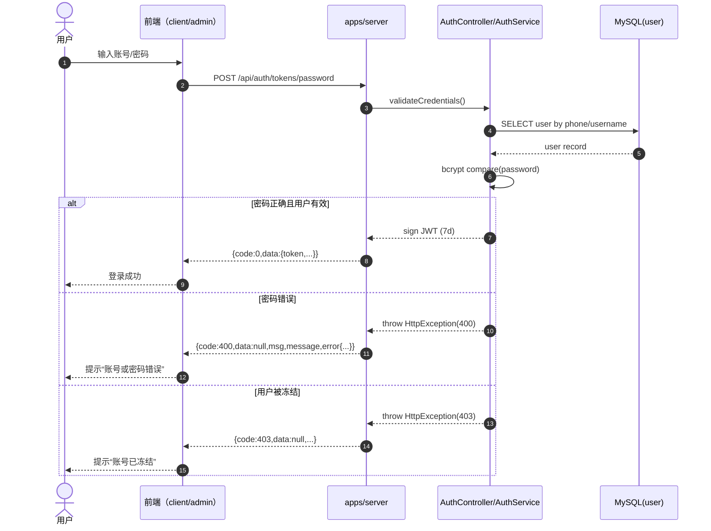
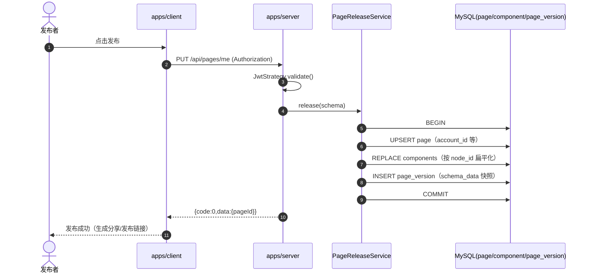
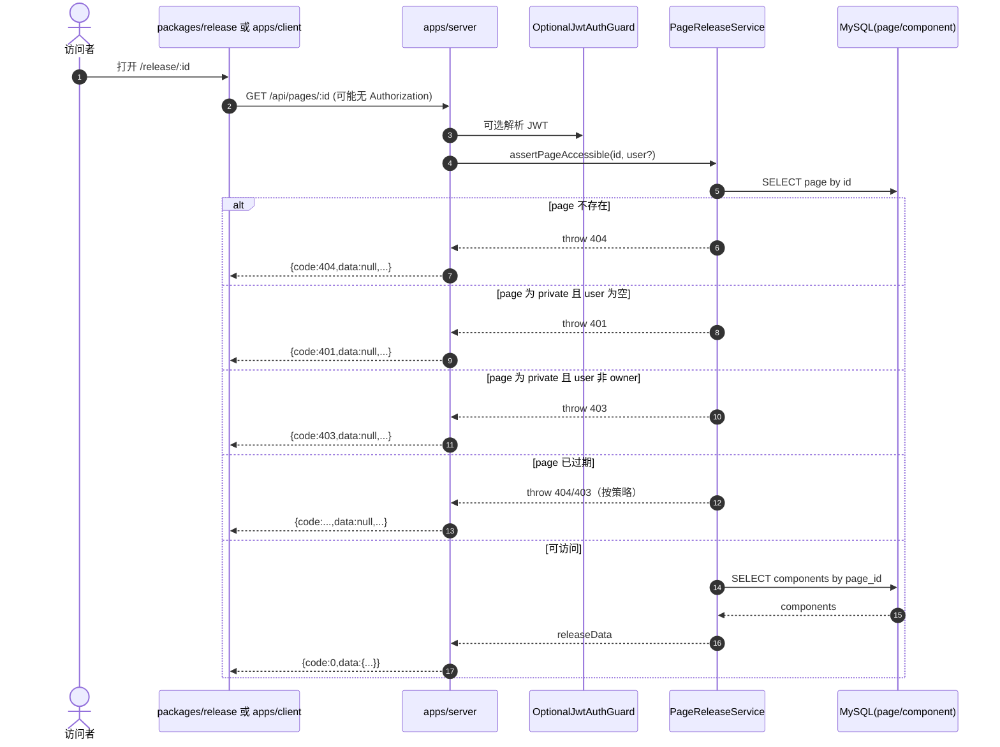
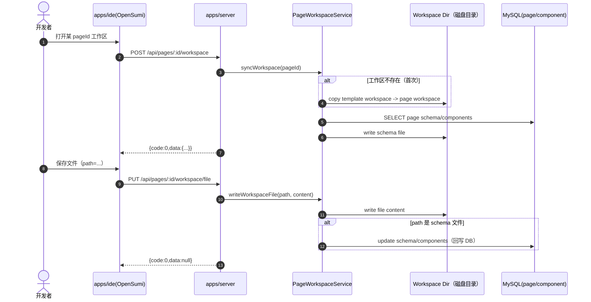
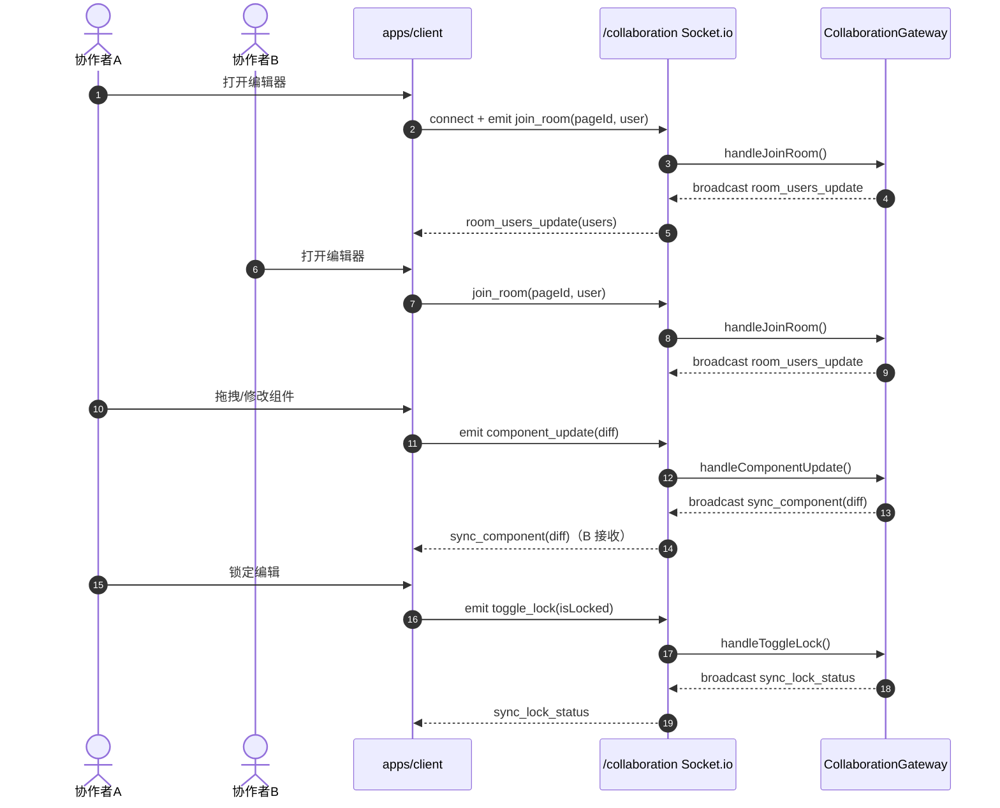
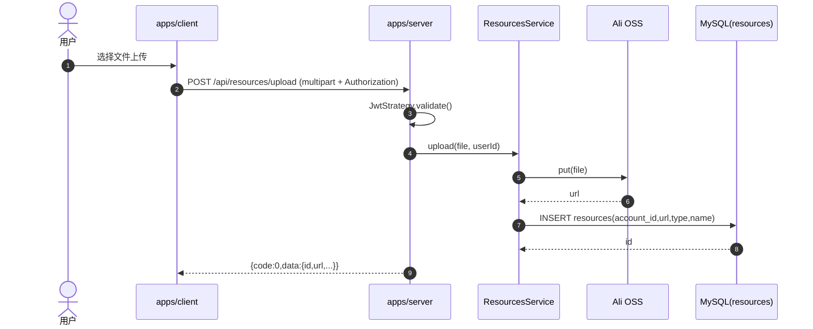
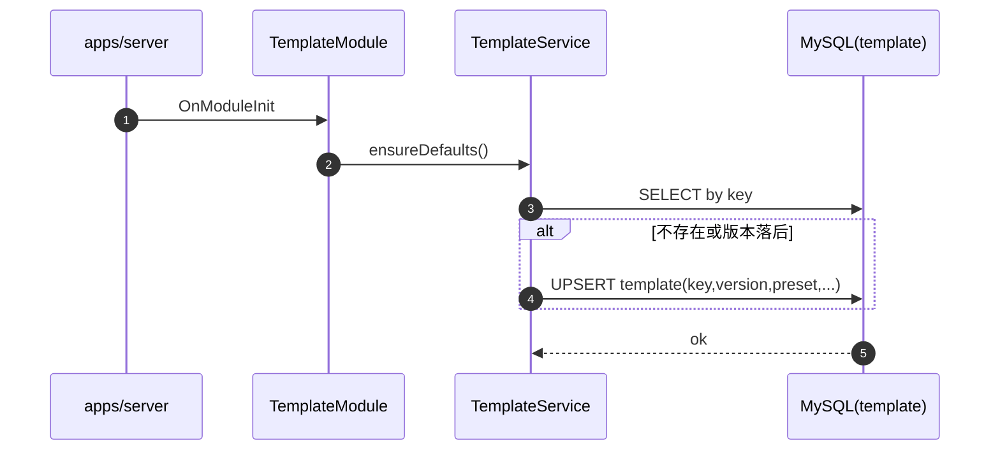
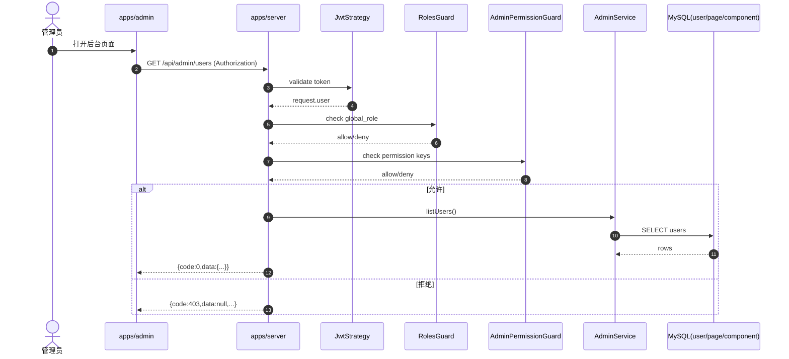

# 5. 核心业务流程时序图（含异常处理）

本章的时序图用于描述“调用链路 + 关键分支 + 异常处理策略”。图稿以 Mermaid 形式嵌入正文，同时建议将相同源码复制到 `.docs/diagrams/` 以便复用与自动渲染。

## 5.1 登录（账号密码）

## 5.2 发布/更新我的页面（生成版本快照）

异常处理策略（建议基线）：
- DB 写入失败：回滚事务，返回 `Code.DatabaseError` 或映射为 `500`，并记录操作日志（见 NFR/可观测性）。
- schema 校验失败：返回 `Code.InvalidParams`，前端提示并定位到具体字段（建议补 DTO 校验）。

## 5.3 获取发布页面（匿名访问 + 可见性/过期判断）

## 5.4 WebIDE 工作区同步与文件写入（文件 <-> DB 一致性）

异常处理策略：
- 文件写入失败：返回 `500` 并携带 `error.details`（不包含敏感路径/内容）。
- schema 回写失败：应回滚到“写前版本”或标记同步失败（建议通过临时文件 + 原子替换保证一致性）。

## 5.5 实时协作（Socket.io：加入房间、组件更新、锁状态同步）

扩展建议：
- 多实例扩容时，Socket.io 需要共享 adapter（如 Redis adapter）以保证跨实例广播。
- 对关键协作事件写入 `operation_log`（已存在实体）以便审计与回放。

## 5.6 资源上传（OSS + 资源表落库）

异常处理策略：
- OSS 上传失败：返回 `500`，前端提示重试；避免将 OSS 内部错误信息透传给客户端。
- DB 落库失败：返回 `502/500`；如 OSS 已上传成功，建议补偿清理或延迟清理任务（避免孤儿对象）。

## 5.7 模板初始化与管理（默认模板 ensureDefaults）

异常处理策略：
- 初始化失败不应导致整个服务不可用（建议降级并报警，避免阻塞启动）。

## 5.8 后台治理权限链（Roles + Permission）

