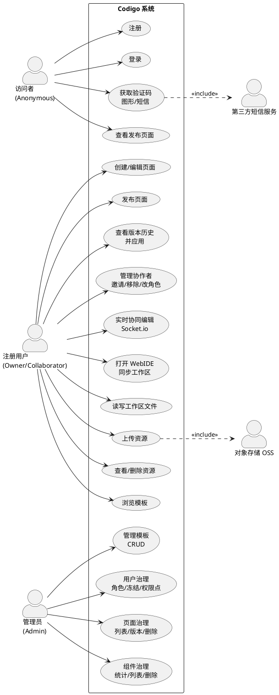

# 6. 用例图与用例规约

## 6.1 系统级用例图

图稿源码：[`usecase-system.puml`](../diagrams/usecase-system.puml)

## 6.2 用例规约

说明：规约中的接口路径以 `apps/server` 为准；若存在新旧接口并存，优先以新接口为主，Legacy 作为兼容方案标注。

### UC-01 注册

- 参与者：访问者
- 前置条件：访问者未登录；手机号/账号未被占用
- 后置条件：创建用户记录；可继续登录或自动登录（以前端策略为准）
- 主成功场景：
  1. 访问者填写注册信息；
  2. 前端调用 `POST /api/users`；
  3. 后端创建 user 并返回成功；
  4. 前端提示注册成功并引导登录。
- 扩展/异常场景：
  - E1：参数缺失/校验失败 → 返回 `600/601`，前端高亮提示。
  - E2：账号已存在 → 返回 `400`，提示“账号已存在”。
- 业务规则：
  - 密码必须加密存储（bcrypt）。
  - 手机号应具备唯一性（当前实体未声明唯一索引，建议补齐）。
- 验收标准：
  - 注册成功后能使用同账号登录；
  - 重复注册返回明确错误码与文案。

### UC-02 登录（密码/手机验证码）

- 参与者：访问者
- 前置条件：用户存在且未冻结
- 后置条件：签发 JWT；前端保存 token
- 主成功场景（密码登录）：
  1. 输入账号/密码；
  2. 调用 `POST /api/auth/tokens/password`；
  3. 服务端校验密码，签发 token；
  4. 返回 token，前端进入系统。
- 扩展/异常场景：
  - E1：密码错误 → `400`
  - E2：冻结用户 → `403`
  - E3：token 过期 → 前端清理 token 并要求重新登录
- 验收标准：
  - token 能访问需鉴权接口（如 `GET /api/pages/me`）；
  - 过期/无效 token 被拒绝并返回统一错误结构。

### UC-03 创建/编辑页面

- 参与者：注册用户（Owner）
- 前置条件：用户已登录
- 后置条件：页面草稿在客户端状态/服务端持久化（按当前实现）
- 主成功场景：
  1. 用户进入编辑器；
  2. 拖拽组件、调整布局、配置属性；
  3. 客户端维护 schema（页面、组件树、全局设置）。
- 扩展/异常场景：
  - E1：协作者无编辑权限 → 拦截编辑动作并提示。
  - E2：组件渲染失败 → 降级为占位，并记录错误日志（见 NFR/可观测性）。
- 业务规则：
  - schema 的跨端类型以 `@codigo/schema` 为单一事实源。
- 验收标准：
  - 组件增删改在画布可见且能正确序列化为 schema；
  - 切换页面/布局模式不应导致非预期重排（需回归测试）。

### UC-04 发布页面

- 参与者：注册用户（Owner）
- 前置条件：用户已登录；schema 合法
- 后置条件：发布数据写入 DB；生成版本快照；可通过发布链接访问
- 主成功场景：
  1. 用户点击发布；
  2. 调用 `PUT /api/pages/me`；
  3. 后端写入 page + components，并生成 page_version 快照；
  4. 返回 pageId，用于生成发布/分享链接。
- 扩展/异常场景：
  - E1：数据库异常 → 返回 `502/500`，前端提示“发布失败”并保留草稿。
  - E2：权限不足 → `403`
- 验收标准：
  - 发布后 `GET /api/pages/:id` 能返回可渲染数据；
  - `GET /api/pages/:id/versions` 能看到新版本记录。

### UC-05 查看发布页面（匿名/登录）

- 参与者：访问者 / 注册用户
- 前置条件：page 存在且满足可见性/过期策略
- 后置条件：页面成功渲染；（可选）记录访问分析
- 主成功场景：
  1. 访问者打开发布链接；
  2. 调用 `GET /api/pages/:id`；
  3. 若 public 且未过期，匿名可访问；
  4. 前端/发布端按返回数据渲染页面。
- 扩展/异常场景：
  - E1：page private 且未登录 → `401`，提示登录并支持回跳。
  - E2：page private 且非 owner → `403`
  - E3：page 过期/不存在 → `404`
- 验收标准：
  - public 页面匿名可打开；
  - private 页面仅 owner 可打开且错误码正确。

### UC-06 管理协作者（邀请/移除/改角色）

- 参与者：注册用户（Owner）
- 前置条件：Owner 已登录；page 存在
- 后置条件：page_collaborator 记录更新
- 主成功场景：
  1. Owner 打开协作设置；
  2. 调用协作者管理接口（GET/POST/PUT/DELETE）；
  3. 后端校验权限并更新协作成员。
- 扩展/异常场景：
  - E1：邀请不存在用户 → `404/400`
  - E2：非 owner 操作 → `403`
- 验收标准：
  - 成员列表正确；
  - 权限变更后编辑器行为同步更新。

### UC-07 WebIDE 打开工作区与读写文件

- 参与者：注册用户（Owner/Collaborator）
- 前置条件：用户已登录且有访问权限
- 后置条件：工作区目录已同步；文件写入成功；（若写 schema）DB 与文件一致
- 主成功场景：
  1. WebIDE 请求 `POST /api/pages/:id/workspace` 同步工作区；
  2. 用户在 IDE 中修改文件；
  3. IDE 调用 `PUT /api/pages/:id/workspace/file` 写入；
  4. 若写入 schema 文件，服务端回写 DB。
- 扩展/异常场景：
  - E1：无权限 → `403`
  - E2：路径穿越/非法 path → `400`（建议补强校验）
- 验收标准：
  - 同步后可正常看到目录树；
  - schema 文件编辑后，页面发布数据与 IDE 文件一致。

### UC-08 后台治理（用户/页面/组件）

- 参与者：管理员
- 前置条件：管理员已登录；满足 Roles 与权限点
- 后置条件：治理动作生效（角色/冻结/权限点、删除页面/组件等）
- 主成功场景：
  1. 管理员访问后台；
  2. 调用 `/api/admin/*` 获取列表/统计；
  3. 执行治理操作（变更角色/冻结/权限点、删除等）。
- 扩展/异常场景：
  - E1：无权限点 → `403`
  - E2：目标不存在 → `404`
- 验收标准：
  - 权限链正确生效（JWT + Roles + Permission）；
  - 治理动作记录可审计（建议写 operation_log）。

